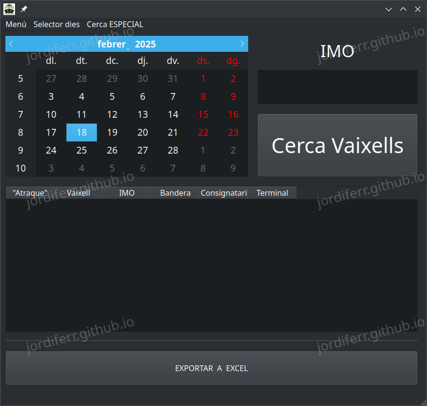

# Qt

Aquest repositori conté diversos projectes desenvolupats en Qt. Bàsicament són petits programes gràfics per a resoldre algun problema puntual i poder practicar amb la programació gràfica.

## <em>Hash files</em>

Aquest programa permet comparar dos fitxers utilitzant la suma de verificació (hash). Mostra visualment si els fitxers són iguals o diferents mitjançant un requadre verd o vermell. A més, compta amb un mètode que permet visualitzar si els fitxers coincideixen o col·lisionen, també utilitzant els colors verd i vermell.
 
 

 
 

 

### Característiques

- Comparació de fitxers mitjançant hash (MD5, SHA-1, SHA-256, etc.).
- Indicació visual (verd/vermell) de si els fitxers són iguals o diferents.
- Detecció de col·lisions de hash amb indicació visual (verd/vermell).

## <em>ShipTracker</em>

El programa ***ShipTracker*** el vaig desenvolupar per a ajudar una ong a facilitar la feina interna que realitzaven reduïnt-ne el temps de tractament de dades.
 
Clica a la següent imatge per anar al repositori
 
 

