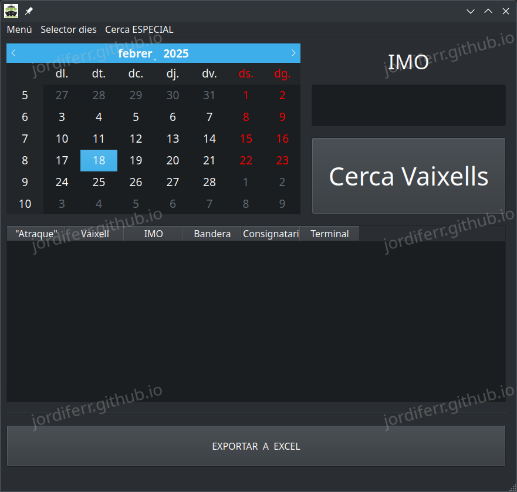

# ShipTracker

El següent programa va ser desenvolupat per a ajudar una ong a facilitar la feina interna que realitzaven reduïnt-ne el temps de tractament de les dades.

## Principal

El programa al engegar-se es veu d'aquesta forma 

El funcionament és el següent:

1. Engegar el programa i esperar 3 segons a que descarregui el UUID de la pàgina on farà les peticions.
2. Seleccionar una data al calendari.
3. Introduir un identificador al QLineEdit.
4. Pressionar el botó "Cerca".

Finalment, si s'ha localitzat, apareixerà la següent pantalla:

I un cop seleccionat una de les opcions, el programa es veurà així:

## Cas especial: Cercar quan no existeix un enter

Quan han de cercar la informació però no disposen d'un enter amb el que fer la cerca, al clicar el botó **CERCA** apareix el següent requadre:

I un cop introduït el text, complet o parcial, apareix el següent llistat a on cercar la informació que es desitja.

I un com seleccionat, el retorna a la pantalla principal:

Ara només els queda clicar a **Exporta a Excel** per a poder treballar amb el seu sistema intern.